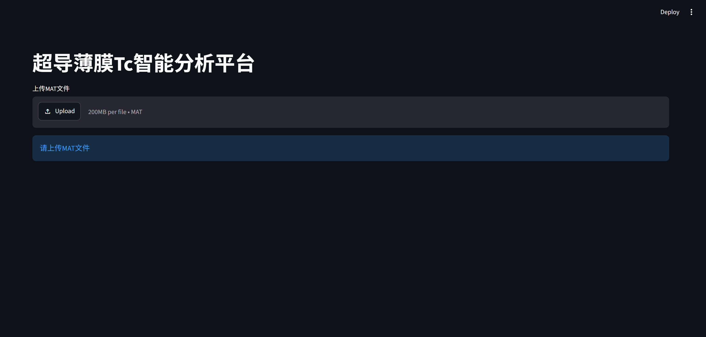
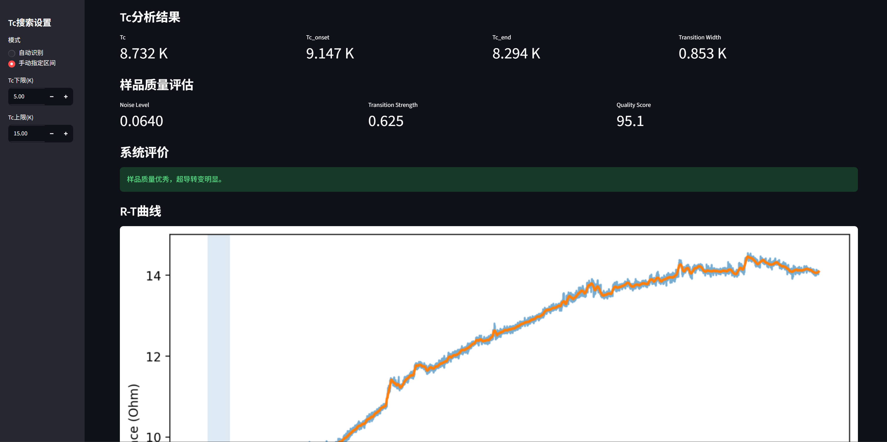
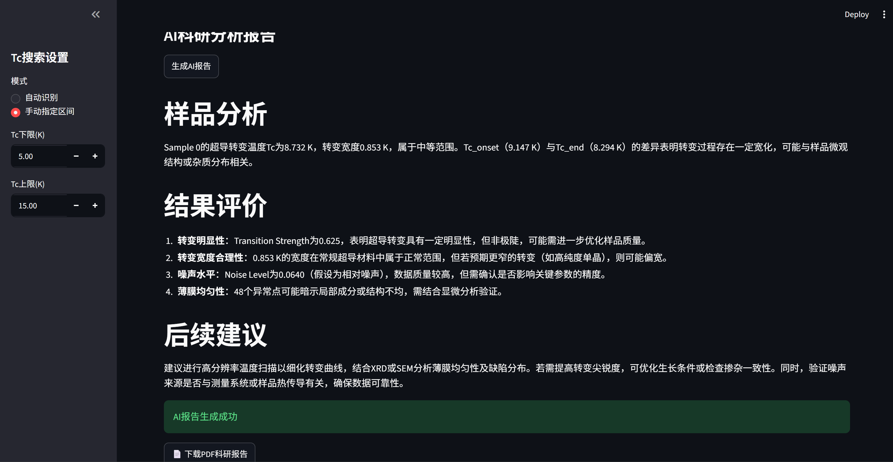
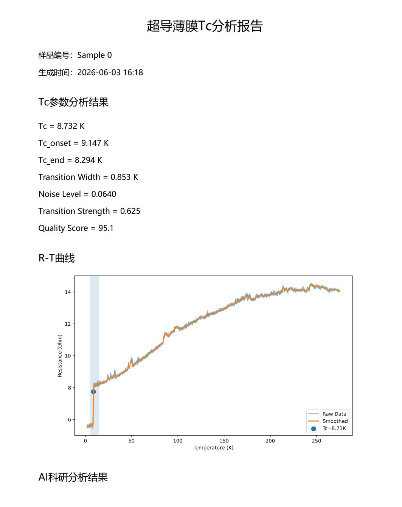
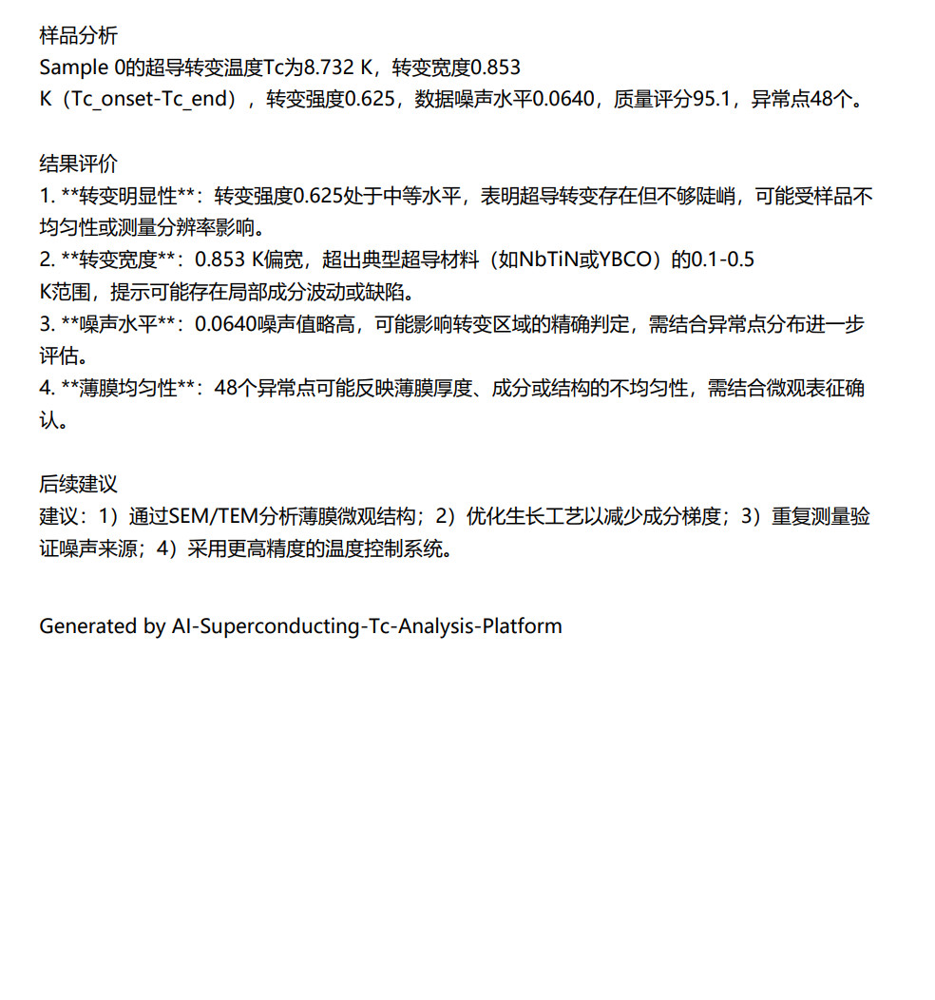

# AI-Superconducting-Tc-Analysis-Platform

## 项目简介

AI辅助超导薄膜Tc智能分析平台。

针对超导电子学实验中大量Tc（超导转变温度）测试数据，开发了一套集数据分析、异常检测、质量评估、AI科研报告生成于一体的智能分析系统。

支持MAT文件读取、Tc自动提取、科研报告自动生成及PDF导出。

---

## 功能展示

### 数据读取

- 支持MAT格式实验数据导入
- 自动识别温度(T)与电阻(R)

### Tc智能分析

- Tc自动提取
- Tc_onset提取
- Tc_end提取
- Transition Width计算

### 曲线处理

- Savitzky-Golay平滑
- R-T曲线可视化
- 手动Tc搜索区间

### 异常检测

- 离群点检测
- 噪声水平评估

### 样品质量评估

- Noise Level
- Transition Strength
- Quality Score

### AI科研分析

基于Qwen3大模型：

- 超导转变分析
- 转变宽度评价
- 噪声水平评价
- 薄膜均匀性分析
- 后续实验建议

### PDF报告导出

自动生成科研风格分析报告：

- Tc参数
- 样品质量评价
- R-T曲线
- AI分析结论

---

## 技术栈

Python

Streamlit

NumPy

SciPy

Matplotlib

OpenAI SDK

Qwen3-8B

SiliconFlow API

ReportLab

---

## 项目架构

MAT Data

↓

Data Processing

↓

Tc Extraction

↓

Quality Evaluation

↓

AI Analysis (Qwen3)

↓

PDF Report Generation

---

## 项目截图

### 主界面



### Tc分析结果



### AI科研分析



### PDF报告



---

## 运行方法

1.安装依赖：

```bash
pip install -r requirements.txt

2.运行项目:

```bash
streamlit run app.py

3.上传MAT文件 → 自动分析 → 生成AI报告 → 下载PDF科研报告

作者

Andy Yang
Nanjing University